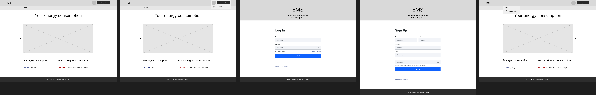

# Energy Management System - Front

This is a [Next.js](https://nextjs.org/) project bootstrapped with [`create-next-app`](https://github.com/vercel/next.js/tree/canary/packages/create-next-app).

You are in Version 1.0.

## Overall description

This project is an energy management system for businesses. This system will enable users to monitor, manage and optimize their energy consumption.

## Version 1.0

Version 1.0 aims to enable users to create an account, view a basic dashboard, collect data and import record data.

### Wireframes

_Those were created with Figma_

**Mobile**


<!-- <- here you should put a link to the containing folder) -->

<!-- <- maybe you should do a gallery instead of one image -->

<!-- <- You have to add to the wireframes "sync" in the navigation for data collection -->

**Desktop**



<!-- <- here you should put a link to the containing folder -->

<!-- <- maybe you should do a gallery instead of one image like following:

- one big image showing the dashboard
- a gallery below of the other pages -->

<!-- <- You have to add to the wireframes "sync" in the navigation for data collection -->

### Features

- Dashboard
  - Energy [kwh] vs time [day] in a form of a histo chart
  - Average consumption
  - Recent Highest consumption
- Import record data
  - .csv format
  - .txt format
- Authentication
- Registration
- Responsive interface
- Data collection
  - Data are collected from a database which is automatically generated by an energy record simulation program (24/7 running process)

## Development planning

**Front**


- [x] 1. Nextjs minimal setup
- [x] 2. Pages creation and basic HTML structure
- [x] 3. Bootstrap integration
- [x] 4. Layout component index.tsx refactoring
- [x] 5. Bootswatch integration
- [x] 6. Landing page bootstrap refactoring
- [x] 7. Signup page bootstrap refactoring
- [ ] 8. Bootstrap navbar integration
  - [ ] Landing page: turn EMS into a clickable brand name redirecting to the home page
- [ ] 9. Dashboard bootsrap refactoring
- [ ] 10. Dummy energy database integration + energy table display
- [ ] 11. Average consumption display with dummy db
- [ ] 12. Highest consumption display with dummy db
- [ ] 13. Import feature: collect & prepare the data for a post request
- [ ] 14. Connect the front to the backend API endpoints

## Stack

### Front

- NextJs, React
- TypeScript
- Bootstrap

### Back

- Python
- Django
- Django REST Framework

### Database

- PostgreSQL

A REST API is used to manage interaction between the frontend and backend.

## Front Structure

- Pages:

  - Landing page with login
  - Dashboard
  - Signup page

- Routing:
  - /
  - /signup/
  - /dashboard/

## Install

### From scratch

**1. NextJs / Ts setups**

1. Install Node.js: Ensure that you have Node.js installed on your machine (In the terminal, type `node -v`). You can download it from the official website (https://nodejs.org) and follow the installation instructions.
2. Initialize a new Next.js project: Open your terminal and navigate to the parent directory where you want to create your project. Then run the following command to create a new Next.js app:

   ```bash
   npx create-next-app energy_management_system_front --typescript
   ```

   **Note**: If you are prompted with messages similar to the following: `What import alias would you like configured? › @/*`, I would recommend to accept. `@/*` is already pre-filled, so you just have to type `Enter` to proceed.

The app is now setup with Next.js with TypeScript. If you want to activate version control, just navigate to newly created directory and run `git int`.

**2. Yarn**

If you want to use yarn as package manager, run the command below:

```bash
yarn install
```

**3. Bootstrap**

1. Install Bootstrap and its dependencies by running the following command:
   ```bash
   yarn add react-bootstrap bootstrap
   ```
   You can use npm also with the adequate command line.
2. Open the `_app.tsx` file located in the `pages` directory. Add this within the import area, at the beginning of the file:

   _\_app.tsx_:

   ```tsx
   // ... other imports
   import "bootstrap/dist/css/bootstrap.min.css";

   // ... rest of the file
   ```

**4. Bootswatch**

1. Install Bootswatch by running the following command:
   ```bash
   yarn add bootswatch
   ```
   You can use npm also with the adequate command line.
2. Open the `_app.tsx` file located in the `pages` directory. Add this within the import area, at the beginning of the file:

   _\_app.tsx_:

   ```tsx
   // ... other imports
   import "bootswatch/dist/lux/bootstrap.min.css";

   // ... rest of the file
   ```

   **Note**: '_lux_' in the import path corresponds to the [Lux Bootswatch theme](https://bootswatch.com/lux/). If you want to use a different theme, just replace this theme name with your own.

### Dependencies

**react bootstrap**

```bash
yarn add react-bootstrap bootstrap
```

**Bootswatch**

```bash
yarn add bootswatch
```

## Getting Started

First, run the development server:

```bash
npm run dev
# or
yarn dev
# or
pnpm dev
```

Open [http://localhost:3000](http://localhost:3000) with your browser to see the result.

You can start editing the page by modifying `pages/index.tsx`. The page auto-updates as you edit the file.

[API routes](https://nextjs.org/docs/api-routes/introduction) can be accessed on [http://localhost:3000/api/hello](http://localhost:3000/api/hello). This endpoint can be edited in `pages/api/hello.ts`.

The `pages/api` directory is mapped to `/api/*`. Files in this directory are treated as [API routes](https://nextjs.org/docs/api-routes/introduction) instead of React pages.

This project uses [`next/font`](https://nextjs.org/docs/basic-features/font-optimization) to automatically optimize and load Inter, a custom Google Font.

## Learn More

To learn more about Next.js, take a look at the following resources:

- [Next.js Documentation](https://nextjs.org/docs) - learn about Next.js features and API.
- [Learn Next.js](https://nextjs.org/learn) - an interactive Next.js tutorial.

You can check out [the Next.js GitHub repository](https://github.com/vercel/next.js/) - your feedback and contributions are welcome!

## Deploy on Vercel

The easiest way to deploy your Next.js app is to use the [Vercel Platform](https://vercel.com/new?utm_medium=default-template&filter=next.js&utm_source=create-next-app&utm_campaign=create-next-app-readme) from the creators of Next.js.

Check out our [Next.js deployment documentation](https://nextjs.org/docs/deployment) for more details.

## Useful resources

- [Github README image gallery](https://felixhayashi.github.io/ReadmeGalleryCreatorForGitHub/): interesting for good looking README files.

## Skills Utilized

**Front-end Design**

- Designing wireframes on paper to optimize user experience
- Creating wireframes using Figma
- Drawing inspiration from competitors, specifically the EDF dashboard at equilibre.edf.fr for competitive intelligence.

**Front-end Web Development**

- Setting up Next.js with TypeScript
- Building user interfaces using Bootstrap
